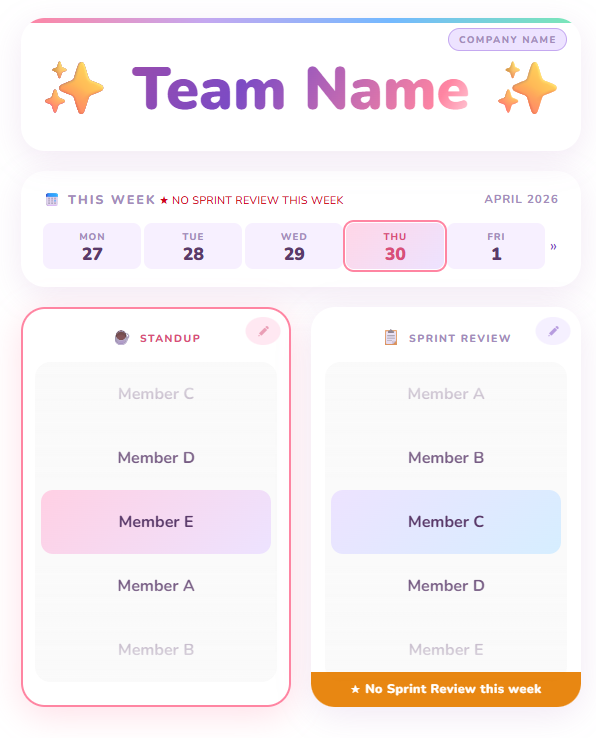
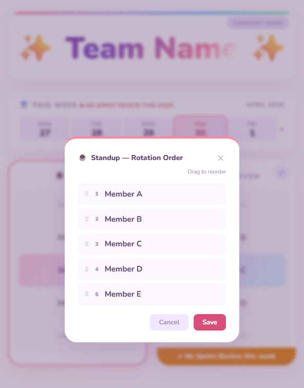

### 🧪 About

A simple web app to manage and visualize host rotations for recurring meetings.

Built in ~2–3 hours as a vibe coding experiment using Claude Sonnet 4.6.

Also used it as a way to learn React by observing how ideas translate into code changes and how those changes become a working product, then using the generated code as material to understand the framework’s core components.

### ✨ Current Features

- 📅 View meeting host for current and upcoming weeks

- 🔁 Multiple rotation groups: Create and manage separate rotation lists for different meeting types

- ✏️ Editable rotation order: Data is stored in *localStorage*

### 🧠 Others
- would be good to to be able to add, remove, and edit members in the rotation list
- would be good if I can add backend integration to connect the app to Microsoft Teams and send automated reminder messages every Monday morning

